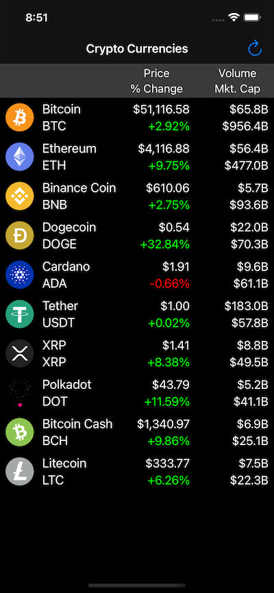
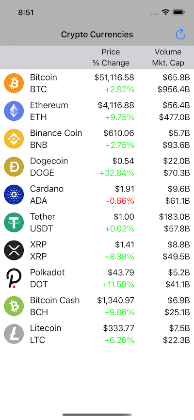

# Cryptocurrency Prices

Cryptocurrency Prices is an iOS app that displays the current pricing of the top 10 cryptocurrencies (by market cap). It is a UIKit app that uses a UICollectionView using CompositionalLayout and DiffableDataSource. And also lays out the constraints programmatically.

It uses the API from coinmarketcap.com to get the prices. It requires an API key, which is free for the basic plan. But there is a daily limit so best not to display too many currencies. Links to the site are in NetworkData.swift.

## License

Cryptocurrency Prices is licensed under the Unlicense. See the LICENSE file for more information, but basically this is sample code and you can do whatever you want with it.
